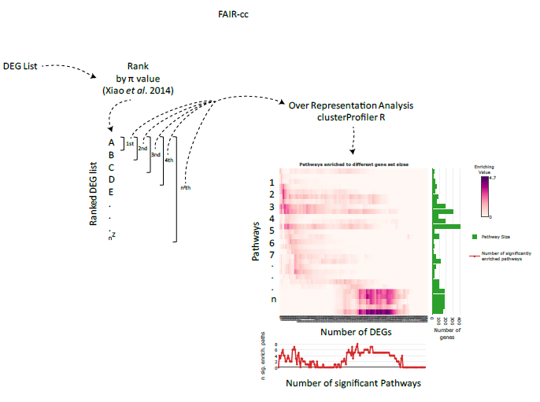

```{r setup, include = FALSE}
knitr::opts_chunk$set(
  collapse = TRUE,
  comment = "#>"
)
```

# Introduction

PEBBA is an enrichment pipeline based on over representation analysis (ORA). It first ranks differentially expressed genes by their $\pi$ values, and then selects the top ten genes, which are used in the ORA, and the genes' enrichment to pathways are noted. At every run, more genes are added and the ORA scores are computed. At the end of the analysis, the whole list of DEGs is run, and users can obtain a profile of how pathways are being enriched with increasing numbers of selected DEGs. As a result, the user will have the enrichment pathways by the number of ranked DEGs sorted by the p-value of the hypergeometric test and then be able to select the cutoff by the number of the significant pathway.



# Basic usage

PEBBA is easily run using only the `pebba` function:  

```{r}
# Get an example data set to apply PEBBA:
library(PEBBA)
data(example_data)
# Use example pathway gmt file:
gmt_fname <- system.file("extdata", "pathways.gmt", package="PEBBA")
pebba(example_data, gmt_fname, force=TRUE)
```

That's it! PEBBA will create a folder in the working directory containing tables with the enrichment results and interactive heatmaps which can be used to obtain different information about each pathway.

# Output tables
PEBBA produces 5 output tables, each with several columns. Let's go over each table.

## PathwayUp, PathwayDown and PathwayAny tables
These tables show the -log10 adjusted p-value of the pathway enrichment analysis, as provided by the [clusterProfiler](https://www.bioconductor.org/packages/release/bioc/html/clusterProfiler.html) R package. Each row represents a particular pathway, and each column is the cutoff number of genes with which the enrichment analysis was run. The table is ordered by the pathways in which significant enrichment occurred with lower cutoff gene values. 

The PathwayUp table shows the results of enriching when the DEG list is in decreasing order of p-values, and conversely for the PathwayDown table. For the PathwayAny table, the DEG list is ordered in increasing order of the absolute p-values.

## Cutoffs table
This table provides information about each cutoff.

- __TopCut__: The cutoff number of genes.    
- __minimum\_log2fc\_*\<direction\>*__: The lowest log2 fold-change value in that direction for each cutoff.  
- __minimum\_MinuslogP_*\<direction\>*__: The -log10 of the largest p-value in that direction for each cutoff.  
- __minimum\_Pi\_*\<direction\>*__: The lowest pi-value in that direction for each cutoff.  

- __minimum\_log2fc\_combined__: The lowest log2 fold-change value in any direction for each cutoff.  
- __minimum\_MinuslogP\_combined__: The -log10 of the largest p-value in any direction for each cutoff.  
- __minimum\_Pi\_combined__: The lowest pi-value in any direction for each cutoff.  

- __maximum\_MinuslogP\_*\<direction\>*__: The largest -log10 of the adjusted p-value in that direction for each cutoff.  
- __sum\_MinuslogP\_*\<direction\>*__: The sum of -log10 of the adjusted p-values in that direction for each cutoff.  
- __times\_significant\_*\<direction\>*__: The proportion of significant pathways in that direction for each cutoff.  

- __maximum\MinuslogP\_meanUPandDOWN__: The mean value of the largest -log10 of the adjusted p-value across both directions for each cutoff. This is the pairwise mean of the "maximum\_MinuslogP\_up" and the "maximum\_MinuslogP\_down" columns.  
- __sum\_MinuslogP\_meanUPandDOWN__: The mean value of the sum of -log10 of the adjusted p-values across both directions for each cutoff. This is the pairwise mean of the "sum\_MinuslogP\_up" and "sum\_MinuslogP\down" columns.  
- __times\_significant\_meanUPandDOWN__: The mean value of the proportion of significant pathways across both directions for each cutoff. This is the pairwise mean of the "times\_significant\_up" and the "times\_significant\_down" columns.  

## Pathway Metrics table
This table returns information about each pathway.

- __Pathways__: Each pathway in the inserted gmt file.   
- __TopCut\_highestMinuslogP\_meanUPandDOWN__: For each pathway, the mean across both directions of which gene number cutoff provided the largest -log10 adjusted p-value.  
- __maximum\_MinuslogP\_meanUPandDOWN__: For each pathway, the mean across both directions of the largest of the -log10 adjusted p-values.  
- __sum\_MinuslogP\_meanUPandDOWN__: For each pathway, the mean across both directions of the sum of the -log10 adjusted p-values.   
- __times\_significant\_meanUPandDOWN__: For each pathway, the mean across both directions of the proportion of columns above the significance cutoff.  
- __FirstTopCut\_significant\_meanUPandDOWN__: For each pathway, the mean across both directions of the first gene number cutoff value in which the pathway was above the significance cutoff. A value of 0 indicates the pathway never surpassed the significance cutoff.   
- __PEBBA\_score\_meanUPandDOWN__: For each pathway, the mean across both directions of the PEBBA score.  

- __TopCut\_highestMinuslogP\_minUPandDOWN__: For each pathway, the minimum value across both directions of which gene number cutoff provided the largest -log10 adjusted p-value.  
- __maximum\_MinuslogP\_maxUPandDOWN__: For each pathway, the maximum value across both directions of the largest of the -log10 adjusted p-values.  
- __sum\_MinuslogP\_maxUPandDOWN__: For each pathway, the maximum value across both directions of the sum of the -log10 adjusted p-values.  
- __times\_significant\_maxUPandDOWN__: For each pathway, the maximum value across both directions of the proportion of columns above the significance cutoff.  
- __FirstTopCut\_significant\_minUPandDOWN__: For each pathway, the minimum value across both directions of the first gene number cutoff value in which the pathway was above the significance cutoff. A value of 0 indicates the pathway never surpassed the significance cutoff.  
- __PEBBA\_score\_maxUPandDOWN__: For each pathway, the maximum value across both directions of the PEBBA score.  

- __TopCut\_highestMinuslogP\_*\<direction\>*__: For each pathway, which gene number cutoff provided the largest -log10 adjusted p-value in that direction.  
- __maximum\_MinuslogP\_*\<direction\>*__: For each pathway, the largest of the -log10 adjusted p-values in that direction.  
- __sum\_MinuslogP\_*\<direction\>*__: For each pathway, the sum of the -log10 adjusted p-values in that direction.  
- __times\_significant\_*\<direction\>*__: For each pathway, the proportion of columns above the significance cutoff in that direction.  
- __FirstTopCut\_significant\_*\<direction\>*__: For each pathway, the first gene number cutoff value in which the pathway was above the significance cutoff in that direction. A value of 0 indicates the pathway never surpassed the significance cutoff.  
- __PEBBA\_score\_*\<direction\>*__: For each pathway, the maximum value of the PEBBA score in that direction.  


